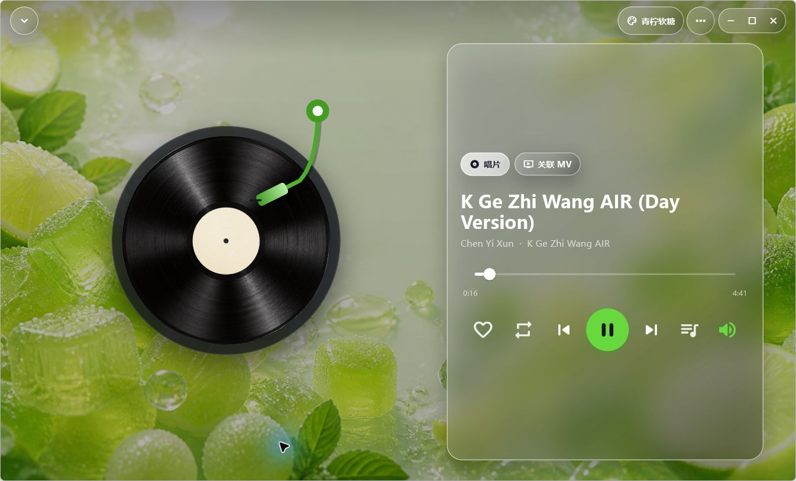

# Sona

> A local-first, offline-ready music player for Windows and Android.

**English** · [简体中文](#简体中文) · [Website](https://sona.yanbaoli.me/?lang=en) · [Download](https://github.com/Owl-Lee/Sona-Player/releases/latest) · [0.4.51 release notes](docs/releases/0.4.51-preview.1.md) · [Documentation](docs/README.md) · [Report an issue](https://github.com/Owl-Lee/Sona-Player/issues)



Sona is made for people who keep their own music files. Import, organize and play music and local MVs without depending on an online catalog or an always-on connection. Its interface combines liquid-glass surfaces, an immersive vinyl player and theme-aware visuals with a practical local library.

## Highlights

- **Local-first playback** — the library, playlists, favorites, queue and listening history remain usable offline.
- **Music and MVs together** — audio and local video share one consistent playback and queue model.
- **Smart metadata cleanup** — media tags, filename parsing and MusicBrainz are combined with optional Chromaprint / AcoustID fingerprint matching on Windows.
- **A personal library** — favorites, playlists, recents, listening charts, search, filters and expressive text covers.
- **Theme-aware design** — liquid glass, vinyl playback, adaptive contrast and wallpaper-specific effects.
- **Three interface languages** — Simplified Chinese, Traditional Chinese and English.

## Download

| Platform | Package | Notes |
| --- | --- | --- |
| Windows 10 / 11 | [Download ZIP](https://github.com/Owl-Lee/Sona-Player/releases/latest/download/Sona-Windows-x64.zip) | 64-bit portable build |
| Android | [Download APK](https://github.com/Owl-Lee/Sona-Player/releases/latest/download/Sona-Android.apk) | Direct install; permanently signed preview |

The current release is a public preview. Download builds only from this repository or the [official Sona website](https://sona.yanbaoli.me/?lang=en). Android builds from 0.4.51 onward use Sona's permanent release certificate.

> **One-time Android upgrade notice:** 0.4.50 used a development certificate and cannot be updated in place. Sync or back up anything important, uninstall 0.4.50 once, then install 0.4.51. Uninstalling clears Sona's app-local database and settings; music files stored outside the app remain untouched. Windows builds are not yet Authenticode-signed, so Windows may show a SmartScreen / Unknown publisher warning.

## How identification works

Sona uses a layered metadata pipeline instead of relying on a single service:

1. Read embedded media tags locally.
2. Clean and interpret the filename.
3. Query the public MusicBrainz catalog when useful.
4. Optionally generate a Chromaprint fingerprint and query AcoustID for difficult tracks.
5. Present candidate metadata for confirmation instead of silently overwriting the library.

Without an AcoustID key, identification still uses local tags, filename cleanup and MusicBrainz. A free AcoustID application key only enables the optional fingerprint fallback.

## Technology

| Area | Stack |
| --- | --- |
| Client | Flutter / Dart · Windows + Android |
| State management | Riverpod |
| Local data | SQLite · FFI on Windows, sqflite on mobile |
| Audio and video | media_kit, audio_service, audio_session |
| Media import | file_picker, audio_metadata_reader |
| Optional sync foundation | Supabase |

## Build from source

```powershell
flutter pub get
flutter analyze
flutter run -d windows
```

Optional AcoustID lookup can be enabled at build time:

```powershell
flutter build windows --release --dart-define=ACOUSTID_API_KEY=YOUR_APPLICATION_KEY
```

## Documentation

The public documentation keeps engineering decisions that may be useful to contributors, while removing machine-specific paths, private operational notes and obsolete handoff details.

- [Documentation index](docs/README.md)
- [Architecture and data flow](docs/architecture/overview.md)
- [Interaction and motion guidelines](docs/design/interaction-and-motion.md)
- [Reliability test matrix](docs/testing/reliability-checklist.md)
- [Development and maintenance guide](docs/contributing/development-guide.md)
- [Curated development history](docs/history/development-notes.md)

## Privacy and scope

Sona is not a music distribution service and does not provide copyrighted tracks. Your local files remain on your device unless you explicitly use an optional sync feature. Cloud services enhance the experience; they are not required for local playback.

---

## 简体中文

> 一款面向 Windows 与 Android 的本地优先、离线可用音乐播放器。

[中文网站](https://sona.yanbaoli.me/) · [下载最新版本](https://github.com/Owl-Lee/Sona-Player/releases/latest) · [0.4.51 发布说明](docs/releases/0.4.51-preview.1.md#简体中文) · [项目文档](docs/README.md) · [提交问题](https://github.com/Owl-Lee/Sona-Player/issues) · [返回英文](#sona)


Sona 面向拥有自己音乐文件的用户。它可以导入、整理并播放本地音乐和 MV，不依赖在线曲库，也不会因为网络断开让本地播放器失去作用。界面以液态毛玻璃、沉浸式黑胶播放器、主题联动视觉和实用曲库管理为核心。

### 主要亮点

- **本地优先：** 曲库、歌单、收藏、播放队列和听歌记录在离线状态仍然可用。
- **音乐与 MV 统一：** 音频和本地视频使用一致的播放、队列和切歌逻辑。
- **智能整理：** 结合媒体标签、文件名语义、MusicBrainz，以及 Windows 端可选的 Chromaprint / AcoustID 声纹回退。
- **完整曲库管理：** 支持收藏、歌单、最近播放、听歌排行、搜索、筛选和文字封面。
- **主题化外观：** 液态玻璃、黑胶唱片、自适应对比度和不同壁纸对应的专属特效。
- **三种界面语言：** 简体中文、繁體中文和 English。

### 下载

| 平台 | 安装包 | 说明 |
| --- | --- | --- |
| Windows 10 / 11 | [下载 ZIP](https://github.com/Owl-Lee/Sona-Player/releases/latest/download/Sona-Windows-x64.zip) | 64 位便携版 |
| Android | [下载 APK](https://github.com/Owl-Lee/Sona-Player/releases/latest/download/Sona-Android.apk) | 直接安装；使用永久发布签名 |

当前版本属于公开预览。请只从本仓库或 [Sona 官方网站](https://sona.yanbaoli.me/)下载安装包。自 0.4.51 起，Android 版本使用 Sona 的永久发布证书。

> **Android 一次性升级提醒：**0.4.50 使用开发证书，无法直接覆盖升级。请先同步或备份重要内容，卸载 0.4.50 一次，再安装 0.4.51。卸载会清除 Sona 的应用内数据库和设置，但不会删除存放在应用外部的音乐文件。Windows 版本暂未使用 Authenticode 代码签名，因此系统可能显示 SmartScreen 或“未知发布者”提示。

### 歌曲信息识别逻辑

Sona 不把所有识别压力交给单一在线服务，而是按层处理：

1. 优先读取本地媒体标签；
2. 清理并理解文件名；
3. 必要时查询 MusicBrainz 公共资料库；
4. 对困难歌曲可生成 Chromaprint 声纹，并通过 AcoustID 查询候选结果；
5. 在覆盖曲库资料前向用户展示候选信息，避免错误结果静默污染曲库。

未配置 AcoustID Key 时，标签、文件名和 MusicBrainz 仍然可以正常工作。免费的 AcoustID 应用 Key 只用于启用可选的声纹回退。

### 隐私与边界

Sona 不是音乐分发服务，也不提供版权歌曲。除非用户主动启用可选同步功能，否则本地音乐文件会保留在设备上；云端是增强能力，不是本地播放的使用前提。

更多设计、架构、测试和维护资料见 [项目文档索引](docs/README.md)。
