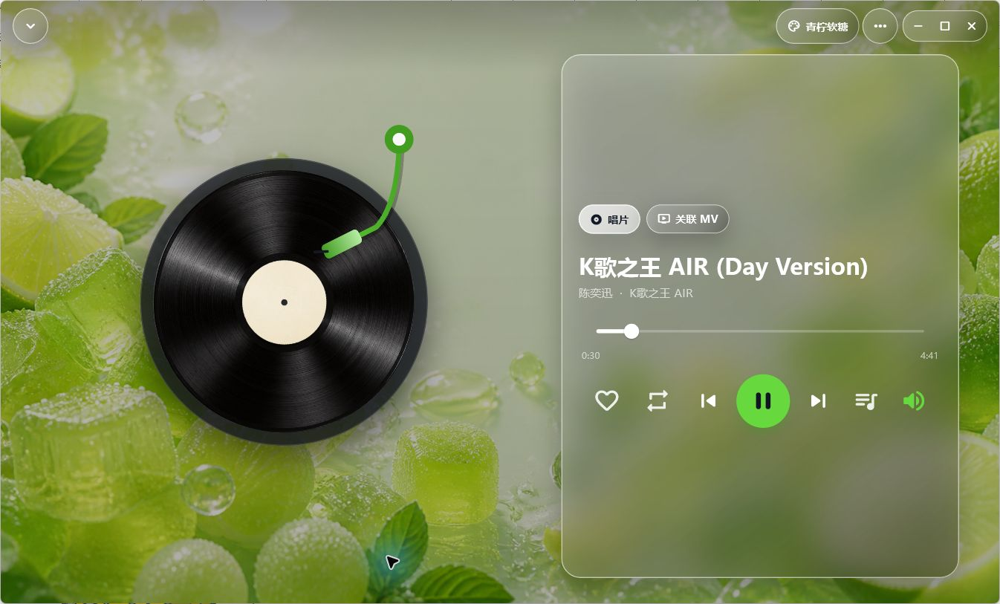

# Sona

> 本地优先、离线可用的私人音乐播放器。面向 Windows 与 Android，数据和音乐文件始终由用户掌握。

Sona 不是在线曲库服务：它帮助你导入、整理和播放自己拥有的音乐与 MV，并以液态玻璃、黑胶播放页和可切换皮肤提供沉浸式桌面体验。

[产品官网](https://owl-lee.github.io/Sona-Player/) · [下载最新版](https://github.com/Owl-Lee/Sona-Player/releases/latest) · [问题反馈](https://github.com/Owl-Lee/Sona-Player/issues)



> 当前发布的是 `0.4.50` 公开预览版。Windows 提供 64 位便携包，Android 提供 APK；Android 包目前使用开发签名，请只从官网或 GitHub Release 下载。

## 当前能力

- 导入单个/多个音乐文件，或递归扫描文件夹；以 SHA-256 和 SQLite 防重复入库。
- 本地曲库、搜索、收藏、最近播放、歌单、播放队列与听歌排行。
- 音乐与本地 MV 管理、关联播放及 MV 专区。
- 黑胶播放页、迷你播放条、音量/随机/循环/播放队列控制。
- Windows 桌面布局与 Android 窄屏适配；播放器皮肤、自定义背景、头像和歌单封面。
- 简体中文、繁體中文和 English 界面切换。
- 云账号和同步基础设施；断网时仍以本地曲库为主，不依赖云端才能播放。
- 歌曲信息智能校准：先清洗标签和文件名，再查询 MusicBrainz；Windows 可通过 Chromaprint/AcoustID 进行真正的音频声纹匹配。

## 技术架构

| 领域 | 方案 |
| --- | --- |
| 客户端 | Flutter / Dart，Windows + Android |
| 状态管理 | Riverpod |
| 本地数据 | SQLite（Windows 使用 FFI，移动端使用 sqflite） |
| 播放与视频 | media_kit、audio_service、audio_session |
| 媒体导入 | file_picker、audio_metadata_reader |
| 云端 | Supabase（账号与同步） |

## 本地运行

```powershell
flutter pub get
flutter analyze
flutter run -d windows
```

如需启用 AcoustID 声纹联网查询，请先免费注册 AcoustID 应用，然后在构建时传入应用 key：

```powershell
flutter build windows --release --dart-define=ACOUSTID_API_KEY=你的应用Key
```

未配置 key 时，“AI 识别歌曲信息”仍会使用本地标签、文件名清洗和免费的 MusicBrainz 公开曲库，不会自动覆盖用户资料；所有候选结果均需用户确认。Chromaprint `fpcalc` 及其 LGPL 2.1 许可证位于 `windows/third_party/chromaprint/`。

Windows 开发环境需要开启开发者模式，以便 Flutter 插件创建符号链接。运行已构建的 Release 程序不需要 Flutter SDK。

## 文档

- [项目技术亮点与讲解](docs/architecture/Sona项目技术亮点与讲解.md)：产品定位、架构与技术讲解。
- [项目工程交接文档](docs/handoff/Sona项目交接文档.md)：功能范围、数据/同步边界及后续注意事项。
- [电脑端续开发交接（2026-08-18）](docs/handoff/Sona电脑端续开发交接-2026-08-18.md)：Windows 当前状态与待验证项。
- [键盘避让与柔和过渡动效规范](docs/design/Sona键盘避让与柔和过渡动效规范.md)：交互和动效约束。
- [历史技术日志](docs/history/Sona-Claude 技术日志.md)：早期迭代记录。

历史文档中的绝对路径仅用于记录当时环境；以仓库根目录为当前源码基准。

## 版本与备份约定

- 每个完成的功能批次都应提交 Git commit 并推送到 GitHub。
- 可交付版本创建 Git tag 和 GitHub Release；安装包作为 Release 附件，不提交 `build/` 目录。
- 私钥、服务端密钥、数据库密码和本地媒体文件不得提交。客户端 publishable key 不等同于服务端密钥。
